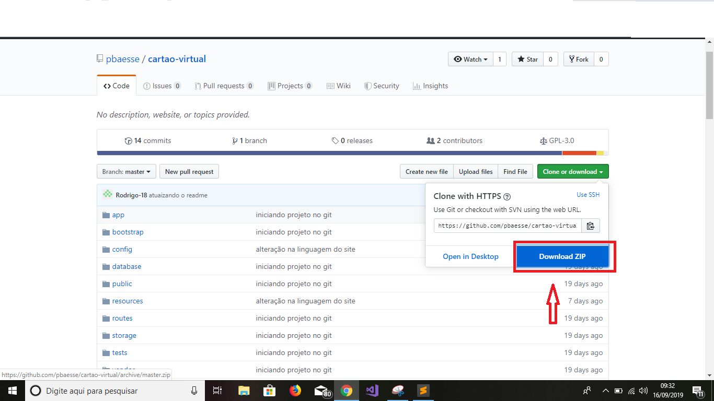
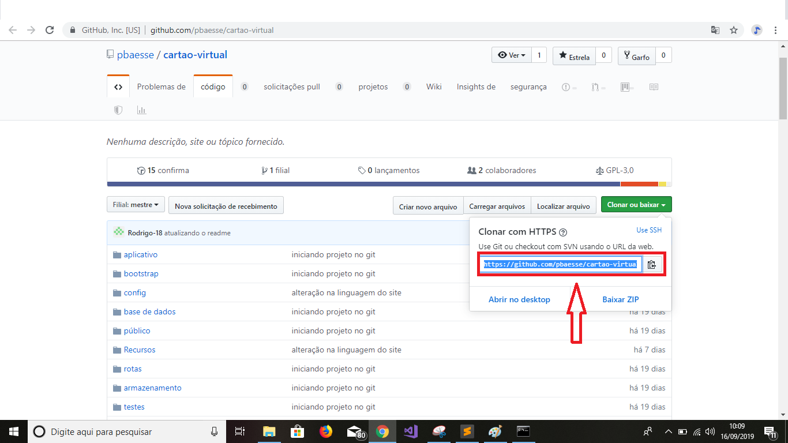

# Cartão Virtual

O projeto possui a capacidade de ajudar no armazenamento de dados
pessoais de cada cliente, de maneira virtual, através da criação de uma página
web.


### Pré-requisitos

O que você precisa ter instalado em sua máquina para rodar essa aplicação:

 
* O framework PHP livre e open-source <a href="https://laravel.com/docs/5.8">Laravel</a> > = 5.2 ;

* Um servidor local. Pode-se usar os dois mais conhecidos:
   * <a href="https://www.apachefriends.org/index.html?tmuid=5cd7132f358a1f59a91213eaff4525b2">XAMPP</a>,
      ou
   * <a href="http://www.wampserver.com/en/">WAMPP</a>
 Ambos vem com o PHP instalado com sua versão mais recente.      


### Instalando

*Primeiro você precisa baixar os arquivos do projeto que estão neste repositório. Temos duas possibilidades:
 
 1. Baixando o arquivo zipado pelo GitHub:

    Neste método precisa-se, apenas, clicar no botão "Clone or download" e clicar em "Download zip", como mostardo na imagem abaixo;
 
    
 
    Depois de baixado, extraia os arquivos no local que achar melhor.

    Observação: Precisa-se de um descompactador de dados, recomendamos o WinRAR.


 2. Clonando os arquivos:

    Por este método precisa ter o Git instalado em sua máquina.

    Abra seu terminal e digite o comando:

    ```
    git clone 

    ```  
    Copie a url do repositório lá no botão "clone or download":

    

    Agora é só colar, no terminal, depois do comando git clone:

    ```
    git clone https://github.com/pbaesse/cartao-virtual.git
    ```

* Agora vamos rodar a aplicação no navegador.
 1. Abra o terminal e entre na pasta que vc baixou. Tanto Windows quanto o Linux utilizam o comando 'cd', para o acesso de diretórios.

 

```
até terminar
```

Termine com um exemplo de como retirar alguns dados do sistema ou usá-los para uma pequena demonstração

## Executando os testes

Explique como executar os testes automatizados para este sistema

### Divida em testes de ponta a ponta

Explique o que esses testes testam e por que

```
Dê um exemplo
```

### E testes de estilo de codificação

Explique o que esses testes testam e por que

```
Dê um exemplo
`` ``

## Desdobramento, desenvolvimento

Adicione notas adicionais sobre como implantar isso em um sistema ativo

## Construído com

* [Dropwizard] (http://www.dropwizard.io/1.0.2/docs/) - A estrutura da web usada
* [Maven] (https://maven.apache.org/) - Gerenciamento de dependências
* [ROMA] (https://rometools.github.io/rome/) - Usado para gerar feeds RSS

## Contribuindo

Leia [CONTRIBUTING.md] (https://gist.github.com/PurpleBooth/b24679402957c63ec426) para obter detalhes sobre nosso código de conduta e o processo para enviar solicitações pull para nós.

## Controle de versão

Usamos [SemVer] (http://semver.org/) para versionar. Para as versões disponíveis, consulte as [tags neste repositório] (https://github.com/your/project/tags).

## Autores

* ** Billie Thompson ** - * Trabalho inicial * - [PurpleBooth] (https://github.com/PurpleBooth)

Veja também a lista de [colaboradores] (https://github.com/your/project/contributors) que participaram deste projeto.

## Licença

Este projeto está licenciado sob a licença MIT - consulte o arquivo [LICENSE.md] (LICENSE.md) para obter detalhes

## Agradecimentos

* Gorjeta para qualquer pessoa cujo código foi usado
* Inspiração
* etc

